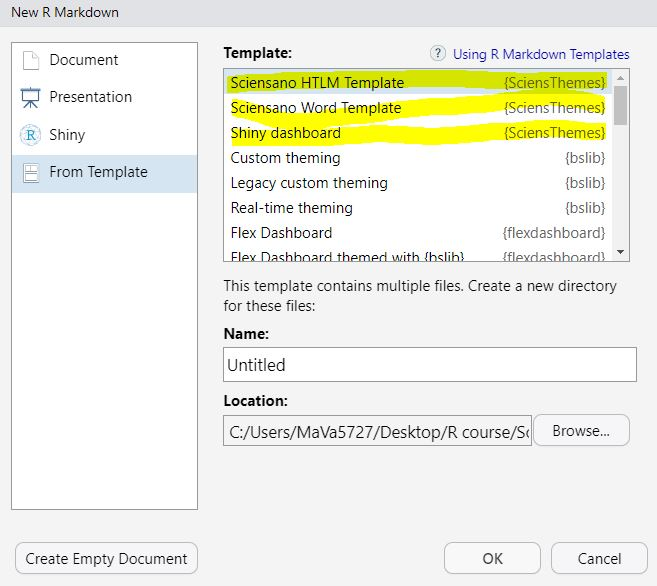
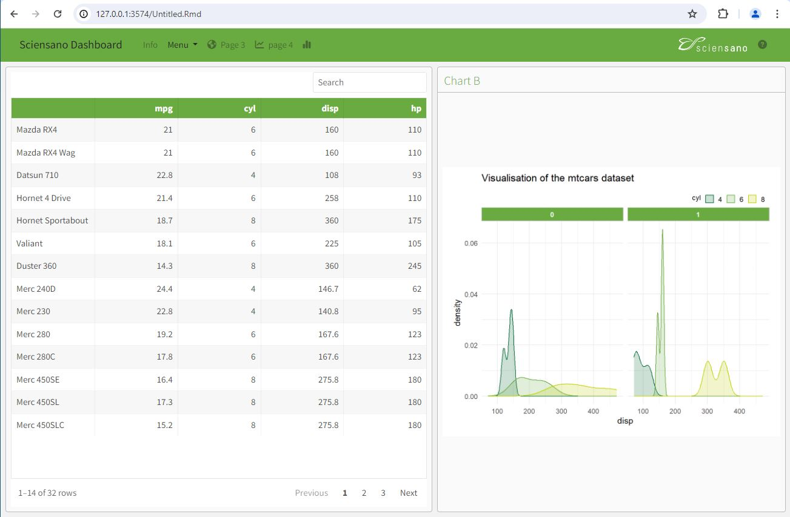
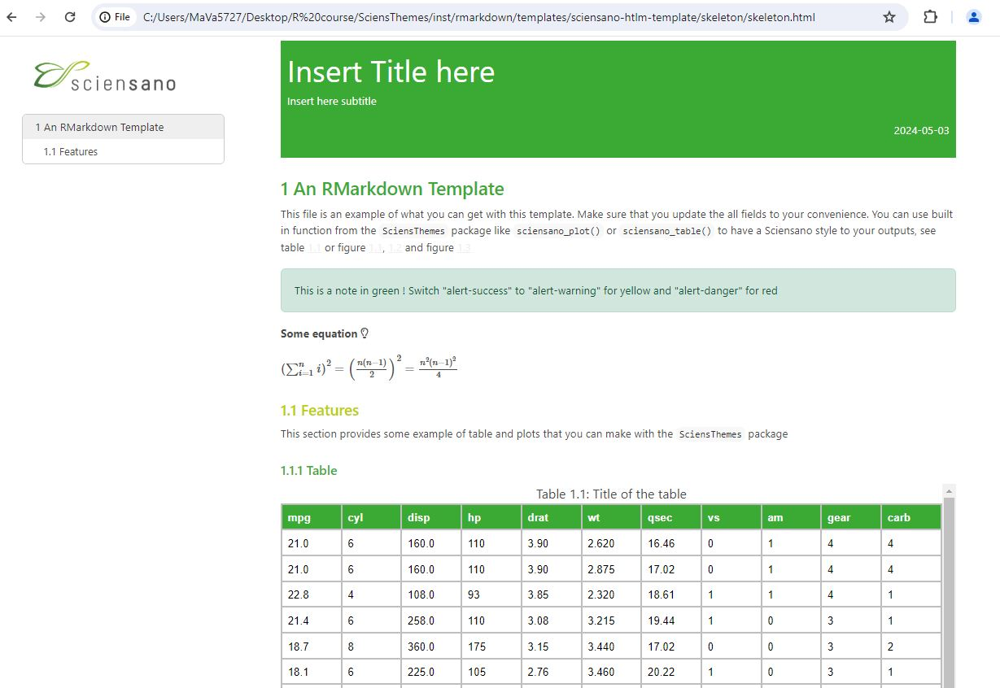
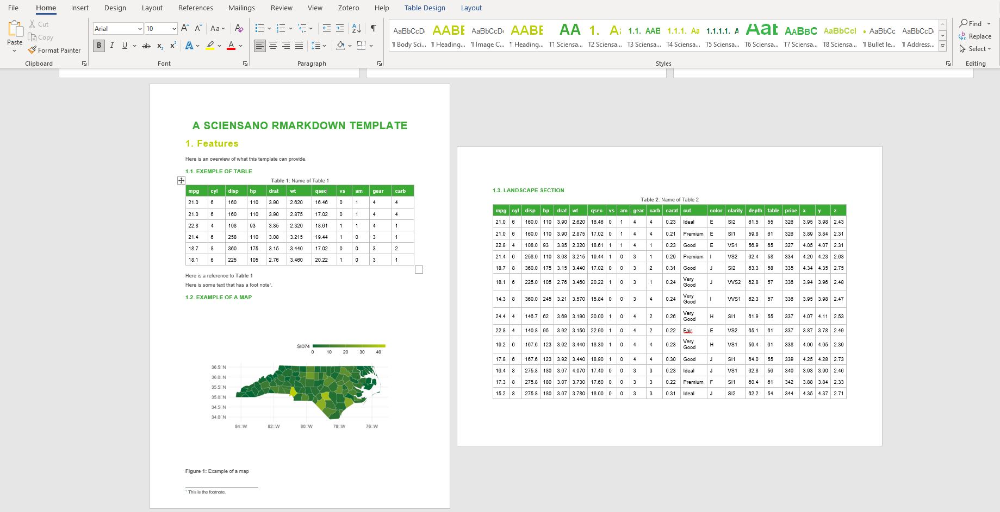

```{r, include = FALSE}
knitr::opts_chunk$set(
  collapse = TRUE,
  comment = "#>"
)
```

```{r setup,, include = FALSE}
knitr::opts_chunk$set(
	message = FALSE,
	warning = FALSE,
	fig.asp=0.9,
	fig.width=5
)
```

```{r}
library(SciensThemes)
library(dplyr)
library(ggplot2)
```

## functions

### Table

```{r table1id, tab.cap="Title of the table"}
head(mtcars)%>%
  sciensano_table()
```

### Figures

```{r fig1id, fig.cap = "Title of graphic", fig.retina=3}

mtcars$cyl<-as.factor(mtcars$cyl)

plot2<-mtcars%>%
  ggplot()+
  aes(disp, fill=cyl, color=cyl)+
  geom_density(alpha=0.2, width=10)+
  facet_wrap(~am)

plot2%>%
  sciensano_plot()

```

## Rmd Templates

you have access to three different type of Rmarkdown:

-   Shiny Flexdashboard

-   HTML

-   Word


Create a new R Markdown document from the menu `File -> New File -> R Markdown -> From Template -> SciensThemes Templates`

{width="300"}

### Shiny Flexdashboard

{width="500"}

### HTML

{width="500"}

### Word

{width="550"}
